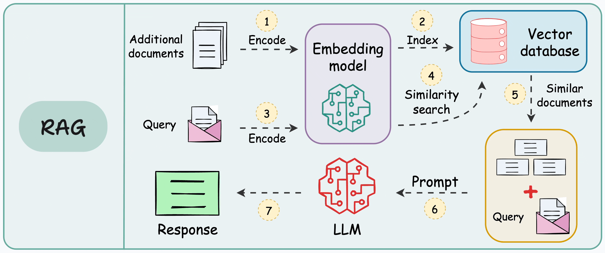

# Intelligent Chatbot RAG System

A robust Question-Answering system using RAG (Retrieval-Augmented Generation) with MLflow tracking and Google's Gemini Pro LLM.

## Architecture

## Key Features
- **RAG Implementation**: Combines retrieval and generation for accurate responses
- **MLflow Integration**: Comprehensive experiment tracking and model monitoring
- **Modular Design**: Well-structured codebase with separation of concerns
- **Google Gemini Pro**: Leverages state-of-the-art language model
- **Web Interface**: Clean and responsive UI for user interactions

## Setup Instructions

1. Create a `.env` file with your API keys
2. Install requirements: `pip install -r requirements.txt`
3. Run the project: `python main.py`
4. View MLflow UI: `mlflow ui`
